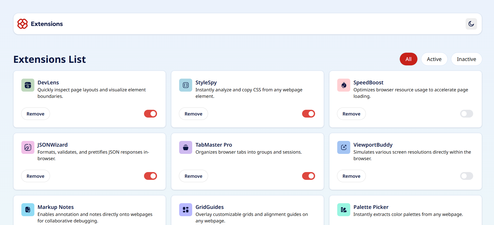
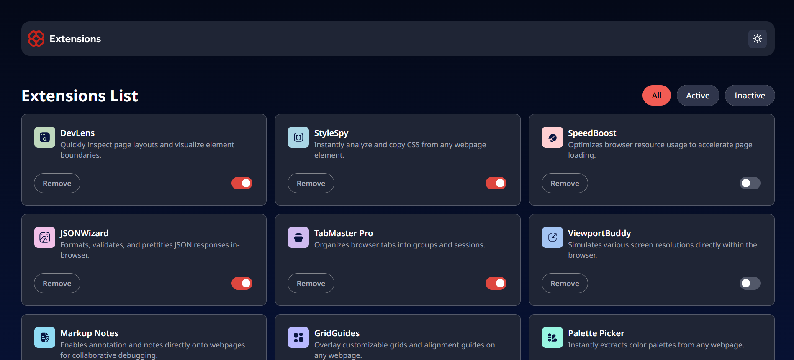

# Frontend Mentor - Browser extensions manager UI solution

This is a solution to the [Browser extensions manager UI challenge on Frontend Mentor](https://www.frontendmentor.io/challenges/browser-extension-manager-ui-yNZnOfsMAp).

## Table of contents

- [The challenge](#the-challenge)
- [Screenshot](#screenshot)
- [Links](#links)
- [My process](#my-process)
  - [Built with](#built-with)
  - [What I learned](#what-i-learned)
  - [Useful resources](#useful-resources)
- [Author](#author)

### The challenge

Users should be able to:

- Toggle extensions between active and inactive states
- Filter active and inactive extensions
- Remove extensions from the list
- Select their color theme
- View the optimal layout for the interface depending on their device's screen size
- See hover and focus states for all interactive elements on the page

### Screenshot

### Links

- Solution URL: [https://github.com/AllanRS19/browser-manager-extension-challenge](https://github.com/AllanRS19/browser-manager-extension-challenge)
- Live Site URL: [https://browser-manager-extension-challenge.vercel.app/](https://browser-manager-extension-challenge.vercel.app/)

## My process

### Built with

- [Vite]
- [React]
- [TailwindCSS]
- Flexbox
- CSS Grid
- Mobile-first workflow

### What I learned

During this project, I learned how to properly organize elements so that they can fit in the screen no matter the device size, as well as implementing the dark mode feature for it.

### Useful resources

- [Vite Documentation](https://vite.dev/guide/) - This is the Vite documentation page, which is what I used to develop this application. In there, I was able to gather and search all the information that I needed to succeed in this challenge.
- [TailwindCSS Documentation](https://tailwindcss.com/docs/dark-mode) - This is by far my preferred CSS framework to style my applications. I used the guide to enable the dark mode feature.

## Author

- Frontend Mentor - [@AllanRS19](https://www.frontendmentor.io/profile/AllanRS19)